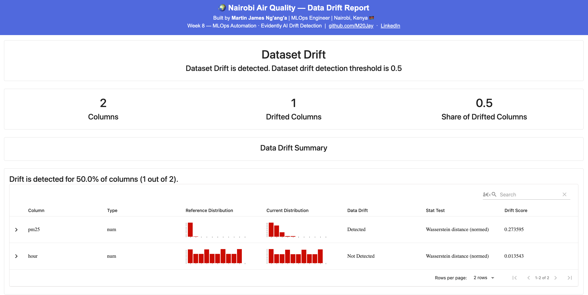
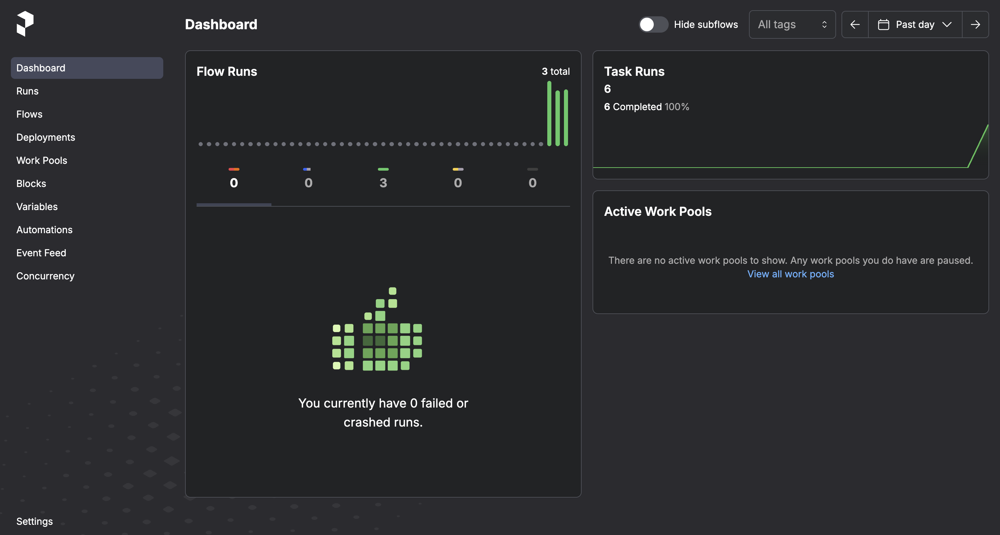
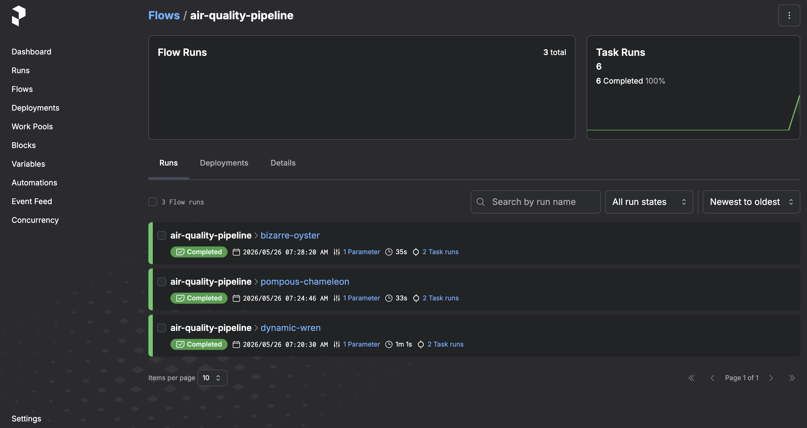
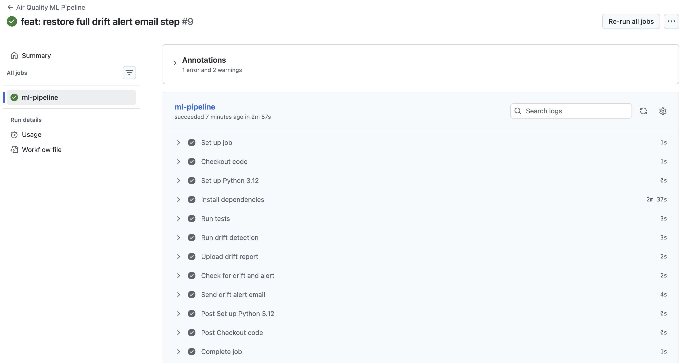

# Air Quality Anomaly Detection Pipeline 🌍


**Production time series forecasting and anomaly detection system for Nairobi air quality monitoring.**

Built by [Martin James Ng'ang'a](https://github.com/M20Jay) — MLOps Engineer | Nairobi, Kenya 🇰🇪

---

## 🔗 Live Deployments

| Service | URL | Description |
|---|---|---|
| 🌍 **Interactive Dashboard** | [nairobi-air-quality-dashboard.onrender.com](https://nairobi-air-quality-dashboard.onrender.com) | Streamlit dashboard — interact with forecasts and anomaly detection |
| ⚡ **Live API** | [air-quality-anomaly-detection.onrender.com/docs](https://air-quality-anomaly-detection.onrender.com/docs) | FastAPI — test all endpoints interactively |

> ⚠️ **Deployment Notice:** APIs previously hosted on Render free tier.
> Currently migrating to AWS EC2 for permanent 24/7 production deployment
> with no cold starts or monthly suspensions.
> All services will be live again by **31 May 2026**.
> Full source code, documentation and screenshots available throughout this repository.

---

## Business Problem

Air quality sensors in Nairobi generate continuous hourly PM2.5 readings. Dangerous pollution events — spikes exceeding 55 µg/m³ — require immediate detection and response. Manual monitoring is not scalable.

This pipeline answers three questions automatically for every sensor reading:

- **Will pollution levels rise?** → ARIMA + Prophet + LSTM forecasting
- **Is this reading dangerous?** → Isolation Forest anomaly detection
- **What is the context?** → Feature attribution and seasonal patterns

---

## Live Results

| Model | RMSE | MAE | MAPE | Type |
|---|---|---|---|---|
| **ARIMA** | **9.93** | **8.35** | **100.64%** | Forecasting ✅ Best |
| LSTM (PyTorch) | 19.46 | 17.87 | 155.28% | Forecasting |
| Prophet | 22.05 | 19.40 | 187.13% | Forecasting |
| Isolation Forest | — | — | 1 anomaly (0.32%) | Anomaly Detection |

**ARIMA is the best performing forecasting model on this dataset.**

---

## Key Findings from EDA

- **11,998 rows** fetched from OpenAQ API across 5 Nairobi locations
- **1,620 hourly readings** after resampling and interpolation
- **Series is stationary** — ADF test confirmed (p=0.0000), d=0
- **Two daily peaks** — 4am and 4pm (traffic and night burning)
- **Worst day** — Friday (above WHO 24-hour limit of 15 µg/m³)
- **Dangerous readings** — 1.8% exceed 55 µg/m³ (US EPA threshold)
- **Maximum spike** — 469 µg/m³ recorded on 2024-02-18 at 4am — 93x the WHO annual safe limit

---

## Tech Stack

| Layer | Technology |
|---|---|
| Data Source | OpenAQ API — real Nairobi PM2.5 sensor data |
| Forecasting | ARIMA · Prophet · LSTM (PyTorch) |
| Anomaly Detection | Isolation Forest (scikit-learn) |
| Feature Engineering | Lag features · Rolling averages · Time features |
| API | FastAPI · Uvicorn · Pydantic |
| Dashboard | Streamlit · Plotly |
| Testing | pytest — 10/10 tests passing |
| Containerisation | Docker · docker-compose |
| Deployment | Render → migrating to AWS EC2 (Week 10) |
| Versioning | DVC · Git |
| Logging | Python logging · Rotating file handler |

---

## Project Structure

```
air-quality-anomaly-detection/
├── configs/                  Model parameters (YAML)
├── data/
│   ├── raw/                  OpenAQ fetched data
│   └── processed/            Clean hourly features
├── models/                   Trained model files
├── notebooks/                EDA — 12 sections
├── screenshots/              Charts and visualisations
├── src/
│   ├── data/                 Ingestion and preprocessing
│   ├── features/             Feature engineering
│   ├── models/               Train and evaluate
│   └── utils/                Logger
├── api/
│   ├── main.py               FastAPI application
│   └── routes/               Forecast and anomaly endpoints
├── tests/                    pytest — 10/10 passing
├── streamlit_app.py          Interactive dashboard
├── Dockerfile
├── docker-compose.yml
└── requirements.txt
```

---

## API Endpoints

| Endpoint | Method | Description |
|---|---|---|
| `/health` | GET | Service health check — model availability |
| `/forecast` | POST | Forecast next N hours of PM2.5 (1-168 hours) |
| `/anomaly` | POST | Detect if a PM2.5 reading is anomalous |

---

## Pipeline Architecture

```
OpenAQ API
    ↓
src/data/ingestion.py         data/raw/
    ↓
src/data/preprocessing.py     data/processed/hourly CSV
    ↓
src/features/feature_engineering.py   data/processed/features CSV
    ↓
src/models/train.py           models/ (ARIMA, Prophet, LSTM, IF)
    ↓
src/models/evaluate.py        RMSE, MAE, MAPE comparison
    ↓
FastAPI endpoints              /forecast  /anomaly  /health
    ↓
Streamlit dashboard            interactive visualisation
    ↓
Docker + AWS EC2               production deployment (migrating from Render Week 10)
```

---

## Running Locally

```bash
git clone https://github.com/M20Jay/air-quality-anomaly-detection.git
cd air-quality-anomaly-detection
pip install -r requirements.txt
python -m src.data.ingestion
python -m src.data.preprocessing
python -m src.features.feature_engineering
python -m src.models.train
python -m src.models.evaluate
uvicorn api.main:app --reload
```

## Running with Docker

```bash
docker-compose up --build
```

## Running Tests

```bash
pytest tests/ -v
```

---

## Model Files

Trained model files are committed to this repository for deployment simplicity. This is intentional for a portfolio project where model files are small (< 1MB total) and trained on publicly available OpenAQ data.

**Production note:** In a production environment model files would be stored in AWS S3, versioned with DVC, and downloaded at container startup. This approach is implemented in the Week 9 Cloud Deployment upgrade of this system.

## Data Privacy

This project uses publicly available OpenAQ air quality sensor data. No personal, financial, or proprietary data was used in training. In a production environment handling sensitaive data, models would never be committed to public repositories.

---

## ⚙️ Week 8 — MLOps Automation

Applying production MLOps tooling to this pipeline as part of the 15-week programme.

| Tool | Purpose | Status |
|------|---------|--------|
| MLflow | Experiment tracking — all 4 models tracked with params, metrics and artifacts | ✅ Complete |
| DVC | Data version control — dataset and model versioning | ✅ Complete |
| Evidently AI | Data drift detection — PM2.5 drift detected (mean 19.02 → 12.50 µg/m³) | ✅ Complete |
| Prefect | Workflow orchestration — 3 successful pipeline runs | ✅ Complete |
| GitHub Actions | CI/CD automation — drift detection + email alerts on every push | ✅ Complete |

---
## 📊 Evidently AI Drift Report

**PM2.5 Drift Detected** — Reference mean 19.02 µg/m³ vs Current mean 12.50 µg/m³



🔗 **Live Report:** [View Drift Report](https://m20jay.github.io/air-quality-anomaly-detection)

---

### Prefect Pipeline Runs



---
### GitHub Actions CI/CD

🔗 **Live Pipeline:** [View Actions](https://github.com/M20Jay/air-quality-anomaly-detection/actions)

---

*Building from Nairobi. For the environment and the world. 🇰🇪*